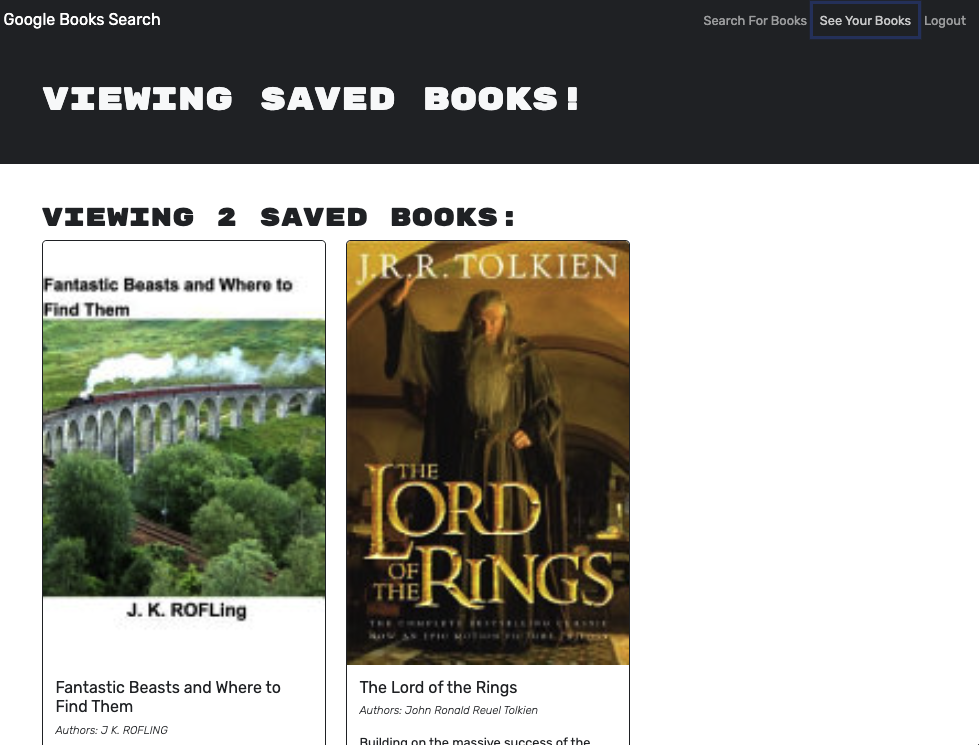
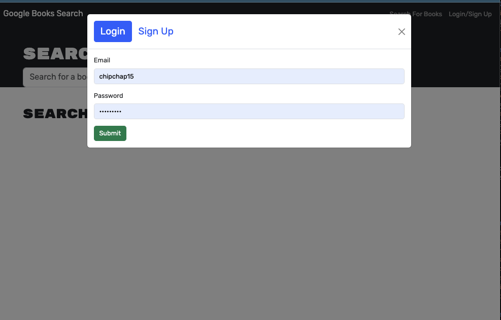

# BOOK SEARCH ENGINE

## Description

Welcome to the 'Book Search Engin'! This ia a project which had functional starter code to begin with. The objective of this project was to refactor the code from using restful APIs to using GraphQL API and its accompanied Apollo server.

## Table of Contents    
- [Description](#description)
- [Repo URL](#repo-url)
- [Installation](#installation)
- [Usage Information](#usage-information)
- [Contribution Guidelines](#contribution-guidelines)
- [Test Instructions](#test-instructions)
- [License](#license)
- [Screenshots](#screenshots)

## Deployed URL

## REPO URL
https://github.com/cmcnamara15/Book-Search 

## Installation
Deployment: The application is deployed on Github Pages. Visit the Heroku link to access the live application. 

## Features

 

## Contribution Guidelines 
Contribution: If you want to contribute to the project, clone the repository, make your changes, and submit a pull request. Please ensure to follow the coding standards outlined in the project documentation. 

## License

## Questions 
If you have any questions please feel free to reach out. 

Github: [cmcnamara15](https://github.com/cmcnamara15) 
Email: cmcnamara1991@icloud.com 
LinkdIn: [cmcnamara15](https://www.linkedin.com/in/chris-mcnamara1991/) 
Personal Portfolio: (https://www.chrismacsportfolio.com)

## Screenshots

The following screenshots shows the apps functionality. 

## Search Results 

## Saved Books Page 

## Login 

